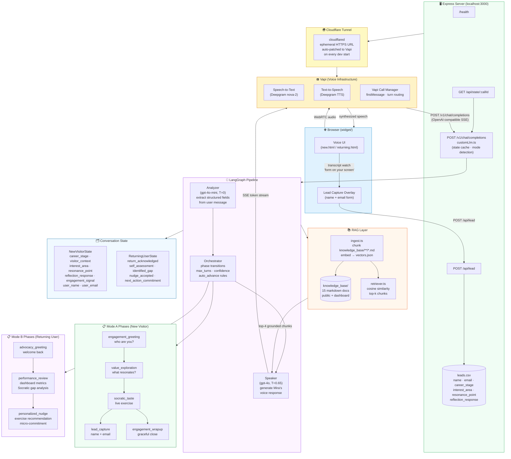

# BoostCTC Voice Agent — Architecture & Technical Stack

> **Purpose:** AI-powered voice agent that runs two modes — (A) new-visitor onboarding and (B) returning-user advocacy — using a custom LLM pipeline, RAG-grounded knowledge, and a Vapi voice layer.

---

## Table of Contents

1. [System Overview](#1-system-overview)
2. [Architecture Diagram (Mermaid)](#2-architecture-diagram)
3. [Data Flow: New Visitor Call (Mode A)](#3-data-flow-mode-a)
4. [Data Flow: Returning User Call (Mode B)](#4-data-flow-mode-b)
5. [Component Deep-Dive](#5-component-deep-dive)
6. [Technical Stack](#6-technical-stack)
7. [Conversation State Machine](#7-conversation-state-machine)
8. [File Structure](#8-file-structure)

---

## 1. System Overview

```
User (browser) ──voice──▶ Vapi (voice infra) ──webhook──▶ Express server
                                                              │
                                              ┌───────────────┼──────────────────┐
                                              ▼               ▼                  ▼
                                         LangGraph        RAG layer         Lead capture
                                         pipeline         (OpenAI            (leads.csv)
                                    (Analyzer→Orch→       embeddings +
                                      Speaker)            cosine search)
```

Every user utterance travels:

1. **User speaks** → Vapi transcribes via Deepgram
2. **Vapi POSTs** to `POST /v1/chat/completions` (our custom-LLM endpoint)
3. **LangGraph pipeline** runs 3 nodes in sequence: Analyzer → Orchestrator → Speaker
4. **Speaker response** is streamed back to Vapi as Server-Sent Events
5. **Vapi synthesizes** the text to speech and plays it to the user
6. When Mira says the lead-capture trigger, the **browser overlay** appears for typed input
7. Submitted leads are written to **leads.csv** with full persona data

---

## 2. Architecture Diagram

### Mermaid source (paste into mermaid.live or any Mermaid renderer)



---

## 3. Data Flow: Mode A (New Visitor)

```
1. User opens new.html → clicks orb → Vapi call starts
2. Vapi speaks firstMessage (elevator pitch) — NO server call yet
3. User replies → Vapi POSTs to /v1/chat/completions with full message array
4. customLlm.ts:
     - Extracts call.id → looks up or creates NewVisitorState (seeded with pitch in history)
     - Appends user message to conversation_history
     - Runs newVisitorGraph.invoke(state)
5. LangGraph node: Analyzer (gpt-4o-mini, T=0)
     - Reads analyzer_template.md + phase skill analyzer.md
     - Extracts: career_stage, visitor_context → interest_area, resonance_point → reflection_response, engagement_signal
     - Returns required_complete, phase_suggestion, confidence
6. LangGraph node: Orchestrator
     - Checks phase registry conditions + confidence ≥ 0.7
     - Advances phase or stays (max_turns safety net)
7. LangGraph node: Speaker (gpt-4o, T=0.65)
     - Builds RAG query from interest_area + career_stage
     - Retrieves top-4 cosine-matched knowledge chunks
     - Builds prompt: speaker_template.md + phase skill speaker.md + snippets + state
     - Generates Mira's spoken response (1–3 sentences)
8. customLlm.ts streams response as SSE → Vapi TTS → user hears Mira
9. State saved to in-memory cache (TTL: 1h)
10. When phase = lead_capture:
     - Mira says "there's a quick form on your screen"
     - Browser transcript listener matches phrase → shows overlay
     - User types name + email → POST /api/lead
     - Backend enriches with career_stage, interest_area, resonance_point, reflection_response
     - Appended to server/data/leads.csv
     - Vapi call ends after 2.5s
```

---

## 4. Data Flow: Mode B (Returning User)

```
1. User opens returning.html → clicks orb → Vapi call starts with welcome-back firstMessage
2. Server creates ReturningUserState seeded with firstMessage in history
3. advocacy_greeting → performance_review → personalized_nudge
4. Speaker loads users.json (demo dashboard metrics: scores, streak, passages)
5. performance_review presents metrics in flowing sentences, asks Socratic gap question
6. If user can't name gap after 2 turns → speaker switches to directive recommendation
7. personalized_nudge gives one specific exercise + asks for micro-commitment
```

---

## 5. Component Deep-Dive

### 5.1 Vapi (Voice Infrastructure Layer)

| Capability | Detail |
|---|---|
| STT | Deepgram nova-2, English |
| TTS | Deepgram (natural voice) |
| Custom LLM | Webhook to `POST /v1/chat/completions` — fully replaces Vapi's built-in LLM |
| firstMessage | Delivered by Vapi itself, before the server is invoked — seeded into state so the LLM never re-pitches |
| Turn management | Vapi handles end-of-speech detection and sends the full message array each turn |

### 5.2 LangGraph Pipeline

Three nodes run sequentially on every turn:

| Node | Model | Temp | Role |
|---|---|---|---|
| **Analyzer** | `gpt-4o-mini` | 0.0 | Deterministic extraction: pulls structured fields (career_stage, interest_area, etc.) from user's message. Never speaks to the user. |
| **Orchestrator** | *(pure logic, no LLM)* | — | Reads registry rules. Advances phase if required_complete + conditions met. Force-advances on max_turns. Routes to wrapup on error threshold. |
| **Speaker** | `gpt-4o` | 0.65 | Generates Mira's spoken response. Reads phase skill instructions + RAG snippets + conversation state. Hard-capped at 1–3 sentences. |

### 5.3 RAG Layer

| Step | Detail |
|---|---|
| **Ingestion** | `ingest.ts` walks `knowledge_base/**/*.md` (15 docs), splits into ~500-char chunks, embeds each with `text-embedding-3-small`, writes `vectors.json` |
| **Retrieval** | Per turn: embed the query → cosine similarity against all vectors → return top-4 chunks |
| **Grounding** | Chunks injected into Speaker prompt under "Knowledge Snippets — your ONLY source of facts" |
| **Contact fallback** | `04-contact.md` is indexed; speaker template also hard-codes `support@boostctc.com` so Mira can redirect any unknown question |

### 5.4 Conversation State Machine

State is a flat TypeScript object (Zod-validated). The Orchestrator reads a JSON phase registry to determine transitions — no transition logic lives in the LLM.

**Phase registries:**

- `new_visitor.phase_registry.json` — 5 phases, conditions, max_turns, auto_advance
- `returning_user.phase_registry.json` — 3 phases

Each phase has two skill files loaded at runtime (no caching — hot-reload on every request):
- `analyzer.md` — what fields to extract, how to classify them, completion criteria
- `speaker.md` — how Mira should sound, what to say, what never to say

### 5.5 Lead Capture

| Step | Detail |
|---|---|
| Trigger | Transcript listener watches for Mira saying "form on your screen" (or variant) |
| Form | Slides up as a modal overlay — user types name + email (no voice spelling) |
| Save | `POST /api/lead` → enriched with `career_stage`, `interest_area`, `resonance_point`, `reflection_response` → appended to `server/data/leads.csv` |
| Close | Call ends 2.5s after successful form submission |

### 5.6 Dev Startup (`npm run dev`)

`dev.ts` orchestrates everything in one command:

1. Spawns Express server on `:3000`
2. Starts `cloudflared` quick tunnel → captures ephemeral HTTPS URL
3. `PATCH`es both Vapi assistants with the new URL (so voice works after every restart)
4. Updates `.env` with the new tunnel URL
5. Opens `http://localhost:3000` in the browser

---

## 6. Technical Stack

| Layer | Technology | Why |
|---|---|---|
| **Voice infrastructure** | [Vapi](https://vapi.ai) | Handles WebRTC, STT (Deepgram), TTS, turn management, and `firstMessage` delivery. We override the LLM with our own endpoint. |
| **STT** | Deepgram nova-2 | Best-in-class accuracy for conversational English; built into Vapi. |
| **LLM orchestration** | [LangGraph (TypeScript)](https://langchain-ai.github.io/langgraphjs/) | Deterministic state machine over LLM nodes. Prevents loops by separating extraction (Analyzer) from transition logic (Orchestrator) from generation (Speaker). |
| **Analyzer LLM** | GPT-4o-mini (OpenAI) | Cheap, fast, temperature=0 — deterministic field extraction from user messages. |
| **Speaker LLM** | GPT-4o (OpenAI) | Best instruction-following for nuanced, persona-consistent voice responses. Temperature 0.65 for natural variation. |
| **Embeddings** | `text-embedding-3-small` (OpenAI) | Efficient, high-quality embeddings for cosine-similarity RAG. |
| **RAG** | Custom cosine search over `vectors.json` | No external vector DB needed for 15 docs. Fast cold start. Re-runs on every query for freshness. |
| **Backend runtime** | Express.js + TypeScript (ESM) | Lightweight server for the custom-LLM webhook, state cache, and lead API. |
| **Schema validation** | [Zod](https://zod.dev) | Runtime type safety for conversation state. Catches LLM output mismatches before they corrupt state. |
| **Tunnel** | Cloudflare Tunnel (`cloudflared`) | Free, no auth required, gives Vapi a public HTTPS URL pointing at localhost. URL auto-patched on every dev start. |
| **Frontend** | Vanilla HTML/CSS/JS | Zero framework overhead. Three pages (landing, new visitor, returning user) with animated glass-morphism UI. |
| **Lead storage** | CSV file (`leads.csv`) | Simple, zero-dependency, opens in Excel/Google Sheets. Fields: timestamp, call_id, name, email, career_stage, interest_area, resonance_point, reflection_response. |
| **Knowledge base** | Markdown files (15 docs) | Easy to edit, version-controlled, automatically chunked and embedded on `npm run ingest`. |

---

## 7. Conversation State Machine

### Mode A — New Visitor

```
engagement_greeting ──(all_required_complete)──▶ value_exploration
                                                         │
                                              (all_required_complete)
                                                         ▼
                                                  socratic_taste
                                                 /              \
                              (engagement_signal=interested)  (engagement_signal=declined)
                                       ▼                              ▼
                                 lead_capture               engagement_wrapup
```

### Mode B — Returning User

```
advocacy_greeting ──(return_acknowledged)──▶ performance_review
                                                      │
                                          (self_assessment + identified_gap)
                                                      ▼
                                             personalized_nudge
                                           (nudge_accepted + next_action_commitment)
```

**Safety nets on every phase:**
- `max_turns` → force-advance if LLM stalls
- `confidence < 0.7` → stay, clarify
- `consecutive_errors ≥ 3` → route to terminal phase
- `turn_count ≥ 30` → force wrapup

---

## 8. File Structure

```
BoostCTC Voice Agent/
├── widget/                          # Frontend (served statically by Express)
│   ├── index.html                   # Landing: choose mode A or B
│   ├── new.html                     # Mode A: new visitor voice UI + lead form overlay
│   ├── returning.html               # Mode B: returning user voice UI + stats strip
│   └── style.css                    # Unified design tokens, glassmorphism, lead overlay
│
├── knowledge_base/                  # RAG source documents (15 markdown files)
│   ├── public/                      # Homepage, About, FAQ, Contact, Sign-up, Legal, articles
│   └── dashboard/                   # Dashboard home, Socratic exercises, Customize experience
│
├── agent_config/                    # Original conversation design (skills / prompts)
│   └── skills/                      # Per-phase analyzer.md + speaker.md templates
│
├── server/
│   ├── src/
│   │   ├── server/
│   │   │   ├── index.ts             # Express app: routes, static serving
│   │   │   ├── customLlm.ts         # Vapi webhook: state cache, mode detection, SSE streaming
│   │   │   └── leads.ts             # CSV writer for lead capture
│   │   ├── graph/
│   │   │   ├── newVisitorGraph.ts   # LangGraph pipeline (Mode A)
│   │   │   ├── returningUserGraph.ts# LangGraph pipeline (Mode B)
│   │   │   └── nodes/
│   │   │       ├── analyzer.ts      # gpt-4o-mini extraction node
│   │   │       ├── orchestrator.ts  # Phase transition logic (no LLM)
│   │   │       └── speaker.ts       # gpt-4o response generation node
│   │   ├── rag/
│   │   │   ├── ingest.ts            # Chunk + embed → vectors.json
│   │   │   └── retriever.ts         # Cosine similarity top-k retrieval
│   │   ├── phases/
│   │   │   ├── new_visitor/         # Per-phase skill files (Mode A)
│   │   │   │   ├── engagement_greeting/{analyzer,speaker}.md
│   │   │   │   ├── value_exploration/{analyzer,speaker}.md
│   │   │   │   ├── socratic_taste/{analyzer,speaker}.md
│   │   │   │   ├── lead_capture/{analyzer,speaker}.md
│   │   │   │   └── engagement_wrapup/{analyzer,speaker}.md
│   │   │   └── returning_user/      # Per-phase skill files (Mode B)
│   │   │       ├── advocacy_greeting/{analyzer,speaker}.md
│   │   │       ├── performance_review/{analyzer,speaker}.md
│   │   │       └── personalized_nudge/{analyzer,speaker}.md
│   │   ├── registry/
│   │   │   ├── new_visitor.phase_registry.json
│   │   │   └── returning_user.phase_registry.json
│   │   ├── prompts/
│   │   │   ├── analyzer_template.md # Global analyzer prompt scaffold
│   │   │   └── speaker_template.md  # Global speaker prompt scaffold + grounding rules
│   │   ├── data/
│   │   │   └── users.json           # Demo returning-user dashboard metrics
│   │   ├── state.ts                 # Zod schemas: NewVisitorState, ReturningUserState
│   │   ├── config.ts                # Model names, temperatures, limits, RAG config
│   │   ├── dev.ts                   # Dev orchestrator: server + tunnel + Vapi patch + open browser
│   │   └── setup_assistants.ts      # One-time: create/update Vapi assistants via API
│   ├── data/
│   │   └── leads.csv                # Captured leads (name, email, persona, reflection)
│   └── rag/
│       └── vectors.json             # Pre-computed embeddings (generated by npm run ingest)
│
└── ARCHITECTURE.md                  # This file
```
