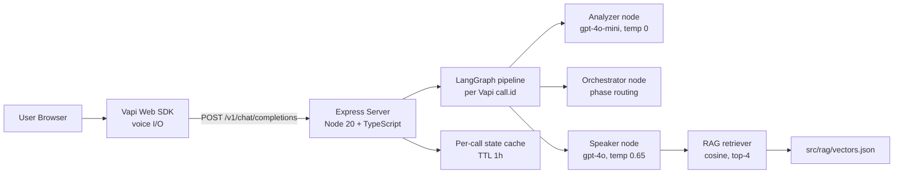
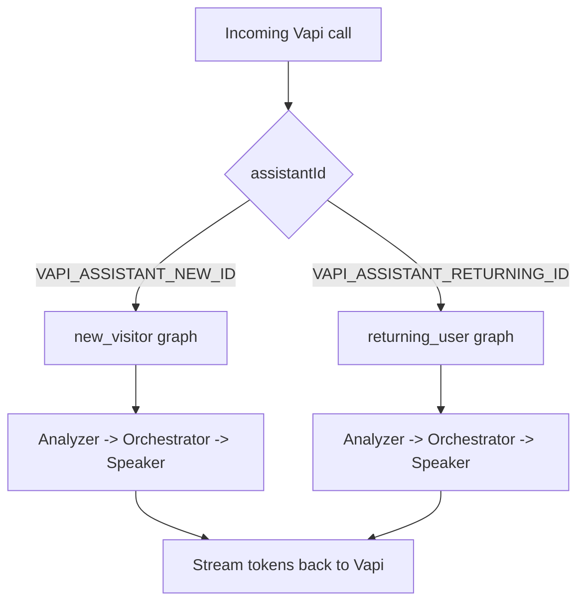

# BoostCTC Voice Agent

> Real-time voice coaching agent built with LangGraph + TypeScript, powered by Vapi custom-LLM and retrieval-augmented responses.

[](./LICENSE)


## Why This Project

- Two conversation experiences: `new_visitor` and `returning_user`.
- Deterministic multi-step orchestration: `Analyzer -> Orchestrator -> Speaker`.
- Local RAG over curated docs for grounded responses.
- Streaming responses optimized for voice latency.

## Quick Start (5 Minutes)

```bash
cd server
npm install
cp .env.example .env
npm run ingest
npm run dev
```

Then open `http://localhost:3000`.

For first-time Vapi setup (assistant creation + tunnel), see [First-Time Setup](#first-time-setup).

## Table of Contents

- [Architecture](#architecture)
- [Mode Flow](#mode-flow)
- [Prerequisites](#prerequisites)
- [First-Time Setup](#first-time-setup)
- [Daily Development](#daily-development)
- [Environment Variables](#environment-variables)
- [Useful Commands](#useful-commands)
- [API Endpoints](#api-endpoints)
- [Troubleshooting](#troubleshooting)
- [Known Limitations](#known-limitations)
- [Roadmap](#roadmap)
- [Data and Security Notes](#data-and-security-notes)
- [Project Structure](#project-structure)
- [Contributing](#contributing)
- [License](#license)

## Architecture



## Mode Flow

| Mode | Assistant Env Var | Phase Flow |
|---|---|---|
| New Visitor | `VAPI_ASSISTANT_NEW_ID` | Greeting -> Value exploration -> Socratic taste -> Lead capture / Wrap-up |
| Returning User | `VAPI_ASSISTANT_RETURNING_ID` | Welcome back -> Performance review (Socratic) -> Personalized nudge |



## Prerequisites

- Node.js 20+
- npm 10+ (or compatible with lockfile)
- `cloudflared` CLI (for local public tunnel during setup/dev)
- Vapi account + API keys
- OpenAI API key

## First-Time Setup

### 1) Install dependencies and configure env

```bash
cd server
npm install
cp .env.example .env
```

Fill required values in `server/.env` (see table below).

### 2) Build RAG index

```bash
cd server
npm run ingest
```

### 3) Create Vapi assistants (one-time)

In one terminal:

```bash
cd server
npm run server
```

In a second terminal:

```bash
cloudflared tunnel --url http://127.0.0.1:3000
```

Copy the generated `https://*.trycloudflare.com` URL into `VAPI_SERVER_URL` in `server/.env`, then run:

```bash
cd server
npm run setup:vapi
```

Save the printed IDs in:

- `VAPI_ASSISTANT_NEW_ID`
- `VAPI_ASSISTANT_RETURNING_ID`

## Daily Development

```bash
cd server
npm run dev
```

## Environment Variables

Defined in `server/.env` (use `server/.env.example` as template):

| Variable | Required | Description |
|---|---|---|
| `OPENAI_API_KEY` | Yes | API key used for generation + embeddings |
| `VAPI_PRIVATE_KEY` | Yes | Server-side Vapi key for assistant setup and backend integration |
| `VAPI_PUBLIC_KEY` | Yes | Public key used by widget/client integration |
| `VAPI_SERVER_URL` | Yes (for Vapi setup/dev) | Public URL Vapi calls for the custom LLM endpoint |
| `VAPI_ASSISTANT_NEW_ID` | Yes (runtime) | Assistant ID for new-visitor mode |
| `VAPI_ASSISTANT_RETURNING_ID` | Yes (runtime) | Assistant ID for returning-user mode |
| `PORT` | No | Express server port (default `3000`) |
| `LANGCHAIN_API_KEY` | Optional | LangSmith tracing key |
| `LANGCHAIN_TRACING_V2` | Optional | Enable tracing (`true`/`false`) |
| `LANGCHAIN_PROJECT` | Optional | LangSmith project name |

## Useful Commands

From `server/`:

| Command | Description |
|---|---|
| `npm run ingest` | Embed `knowledge_base/**` and regenerate `src/rag/vectors.json` |
| `npm run dev` | Start server with watch mode |
| `npm run build` | Compile TypeScript to `dist/` |
| `npm start` | Run compiled app |
| `npm run setup:vapi` | Create or update Vapi assistants |
| `npm run typecheck` | Run TypeScript checks without emit |

## API Endpoints

- `POST /v1/chat/completions`  
  Vapi custom-LLM endpoint. Accepts Vapi-style chat payloads and returns streamed output.

- `POST /api/lead`  
  Saves a lead record to local CSV (`server/data/leads.csv`) during local development.

## Troubleshooting

- **`OPENAI_API_KEY not set`**  
  Ensure `server/.env` exists and includes `OPENAI_API_KEY`.

- **Vapi setup fails with missing assistant IDs**  
  Run `npm run setup:vapi` after setting `VAPI_SERVER_URL` and keys.

- **Tunnel URL expired / calls stop arriving**  
  Restart `cloudflared`, update `VAPI_SERVER_URL`, and rerun assistant setup.

- **RAG returns weak or stale results**  
  Re-run `npm run ingest` after editing `knowledge_base/**`.

- **Port already in use**  
  Change `PORT` in `.env` or stop the conflicting process.

## Known Limitations

- Local lead storage uses CSV (not a production database).
- Local development expects a public tunnel for Vapi callbacks.
- No full auth/rate-limiting layer is included in this repo.
- RAG quality depends on the freshness of `knowledge_base/**`.

## Roadmap

- Add a production persistence layer for leads and call metadata.
- Add automated tests for graph transitions and endpoint contracts.
- Add CI checks for lint/typecheck/build on pull requests.
- Add deploy templates for a cloud environment.

## Data and Security Notes

- Do not commit `.env` files or local lead data.
- This repository ignores sensitive/local artifacts via `.gitignore`.
- If secrets were ever exposed, rotate them before production use.
- Use synthetic or anonymized data only in public repos.

## Project Structure

```text
server/src/
  graph/                  LangGraph workflows and nodes
  phases/                 Analyzer/Speaker prompt modules by phase
  prompts/                Shared prompt templates
  rag/                    Ingest + retrieval
  registry/               Phase registries and state schemas
  server/                 Express routes and handlers

widget/                   Browser voice UI
knowledge_base/           Public/domain docs used for RAG
agent_config/             Config/prompt assets
legacy/                   Old Python implementation (reference)
```

## Contributing

1. Fork and create a feature branch.
2. Keep changes focused and document behavior changes.
3. Run type checks/build before opening PR.
4. Never commit secrets or user data.

## License

This project is licensed under the MIT License - see [`LICENSE`](./LICENSE).
