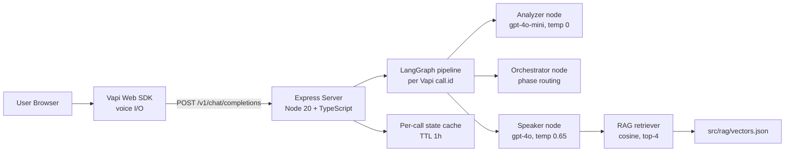
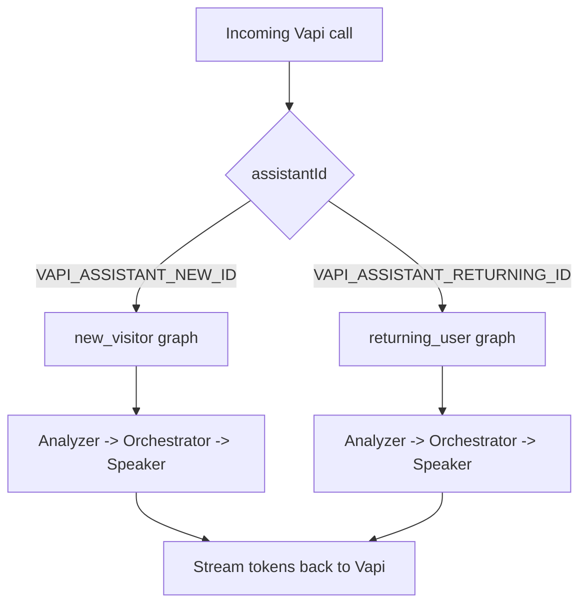

# Boost CTC Voice Agent

> An AI voice coach that turns landing-page traffic into real conversations. Visitors talk to it, get one useful coaching insight, and decide whether to sign up.

[](./LICENSE)


**Live:** [boostctc.com](https://boostctc.com) &nbsp;·&nbsp; **Demo:** _(add Loom or GIF here)_

)

---

## What Boost CTC Is

Boost CTC is a coaching platform for communication and critical-thinking skills. The voice agent in this repo is the front door: it sits on the landing page, greets cold visitors, has a short conversation about what they're trying to improve, and either captures a lead or sends them off with one concrete takeaway.

The whole experience is built around the idea that a 60 to 90 second voice exchange converts better than a contact form, and that the conversation itself should feel like a real coaching micro-session rather than a chatbot interview.

## Built With

LangGraph for orchestration, Vapi for voice I/O and custom-LLM integration, OpenAI `gpt-4o` and `gpt-4o-mini` for generation, TypeScript on Node 20 with Express, and a local cosine-similarity RAG layer over curated docs.

## Quick Start

```bash
cd server
npm install
cp .env.example .env
npm run ingest
npm run dev
```

Open `http://localhost:3000`. For first-time Vapi setup (assistant creation plus a public tunnel), see [First-Time Setup](#first-time-setup).

## Table of Contents

- [How It Works](#how-it-works)
- [Architecture](#architecture)
- [Mode Flow](#mode-flow)
- [Prerequisites](#prerequisites)
- [First-Time Setup](#first-time-setup)
- [Daily Development](#daily-development)
- [Environment Variables](#environment-variables)
- [Useful Commands](#useful-commands)
- [API Endpoints](#api-endpoints)
- [Troubleshooting](#troubleshooting)
- [Out of Scope for v1](#out-of-scope-for-v1)
- [Roadmap](#roadmap)
- [Data and Security Notes](#data-and-security-notes)
- [Project Structure](#project-structure)
- [Contributing](#contributing)
- [License](#license)

## How It Works

Every turn runs through three nodes: **Analyzer → Orchestrator → Speaker**. The split is deliberate.

**Analyzer** (`gpt-4o-mini`, temperature 0). Cheap and fast. It looks at the latest user utterance plus call state and classifies intent and current conversation phase. Around 150 ms per call.

**Orchestrator** (pure TypeScript, no LLM). Takes the analyzer's output and the current state, and decides what phase comes next. Because routing lives in code instead of a prompt, the conversation cannot be steered off the rails by a creative model. Phase transitions are auditable.

**Speaker** (`gpt-4o`, temperature 0.65). The only node that actually talks. It receives a locked phase, pulls relevant context from the RAG index, and generates voice-optimized output (short sentences, natural pacing, streamable tokens).

The result: one cheap LLM call plus one expensive one per turn, deterministic flow control, and prompt logic that stays small enough to actually reason about.

## Architecture



## Mode Flow

| Mode | Assistant Env Var | Phase Flow |
|---|---|---|
| New Visitor | `VAPI_ASSISTANT_NEW_ID` | Greeting → Value exploration → Socratic taste → Lead capture / Wrap-up |
| Returning User | `VAPI_ASSISTANT_RETURNING_ID` | Welcome back → Performance review (Socratic) → Personalized nudge |



## Prerequisites

- Node.js 20+
- npm 10+ (or compatible with the lockfile)
- `cloudflared` CLI (for the local public tunnel during setup and dev)
- A Vapi account and API keys
- An OpenAI API key

## First-Time Setup

### 1. Install dependencies and configure env

```bash
cd server
npm install
cp .env.example .env
```

Fill in the required values in `server/.env` (see the table below).

### 2. Build the RAG index

```bash
cd server
npm run ingest
```

### 3. Create Vapi assistants (one-time)

In one terminal:

```bash
cd server
npm run server
```

In a second terminal:

```bash
cloudflared tunnel --url http://127.0.0.1:3000
```

Copy the generated `https://*.trycloudflare.com` URL into `VAPI_SERVER_URL` in `server/.env`, then run:

```bash
cd server
npm run setup:vapi
```

Save the printed IDs in:

- `VAPI_ASSISTANT_NEW_ID`
- `VAPI_ASSISTANT_RETURNING_ID`

## Daily Development

```bash
cd server
npm run dev
```

## Environment Variables

Defined in `server/.env` (use `server/.env.example` as a template):

| Variable | Required | Description |
|---|---|---|
| `OPENAI_API_KEY` | Yes | API key used for generation and embeddings |
| `VAPI_PRIVATE_KEY` | Yes | Server-side Vapi key for assistant setup and backend integration |
| `VAPI_PUBLIC_KEY` | Yes | Public key used by the widget and client integration |
| `VAPI_SERVER_URL` | Yes (for Vapi setup and dev) | Public URL Vapi calls for the custom-LLM endpoint |
| `VAPI_ASSISTANT_NEW_ID` | Yes (runtime) | Assistant ID for new-visitor mode |
| `VAPI_ASSISTANT_RETURNING_ID` | Yes (runtime) | Assistant ID for returning-user mode |
| `PORT` | No | Express server port (default `3000`) |
| `LANGCHAIN_API_KEY` | Optional | LangSmith tracing key |
| `LANGCHAIN_TRACING_V2` | Optional | Enable tracing (`true` or `false`) |
| `LANGCHAIN_PROJECT` | Optional | LangSmith project name |

## Useful Commands

From `server/`:

| Command | Description |
|---|---|
| `npm run ingest` | Embed `knowledge_base/**` and regenerate `src/rag/vectors.json` |
| `npm run dev` | Start server in watch mode |
| `npm run build` | Compile TypeScript to `dist/` |
| `npm start` | Run the compiled app |
| `npm run setup:vapi` | Create or update Vapi assistants |
| `npm run typecheck` | Run TypeScript checks without emit |

## API Endpoints

`POST /v1/chat/completions`
Vapi custom-LLM endpoint. Accepts Vapi-style chat payloads and returns streamed output.

`POST /api/lead`
Saves a lead record to a local CSV (`server/data/leads.csv`) during local development.

## Troubleshooting

**`OPENAI_API_KEY not set`**
Make sure `server/.env` exists and includes `OPENAI_API_KEY`.

**Vapi setup fails with missing assistant IDs**
Run `npm run setup:vapi` after setting `VAPI_SERVER_URL` and your keys.

**Tunnel URL expired or calls stop arriving**
Restart `cloudflared`, update `VAPI_SERVER_URL`, and rerun assistant setup.

**RAG returns weak or stale results**
Re-run `npm run ingest` after editing anything under `knowledge_base/**`.

**Port already in use**
Change `PORT` in `.env` or stop the conflicting process.

## Out of Scope for v1

These are intentional scope choices, not bugs.

- Lead storage uses a local CSV. Production persistence is planned but not in v1.
- Local development requires a public tunnel for Vapi callbacks. No managed hosting yet.
- No auth or rate-limiting layer is bundled in this repo.
- RAG quality is bounded by the freshness of `knowledge_base/**`. Re-ingest after edits.

## Roadmap

**Product**

- Multi-turn memory across sessions for returning users
- Coach persona variants (different voice, tone, and pacing profiles)
- Multilingual support starting with Hindi and Spanish
- In-conversation feedback signals (clarity score, hedging detection)

**Engineering**

- Production persistence layer for leads and call metadata
- Automated tests for graph transitions and endpoint contracts
- CI for lint, typecheck, and build on pull requests
- Deploy templates for a managed cloud environment

## Data and Security Notes

- Do not commit `.env` files or local lead data.
- This repository ignores sensitive and local artifacts via `.gitignore`.
- If secrets were ever exposed, rotate them before production use.
- Use only synthetic or anonymized data in public repos.

## Project Structure

```text
server/src/
  graph/         LangGraph workflows and nodes
  phases/        Analyzer and Speaker prompt modules by phase
  prompts/       Shared prompt templates
  rag/           Ingest and retrieval
  registry/      Phase registries and state schemas
  server/        Express routes and handlers

widget/          Browser voice UI
knowledge_base/  Public-domain docs used for RAG
agent_config/    Config and prompt assets
legacy/          Old Python implementation (reference)
```

## Contributing

1. Fork and create a feature branch.
2. Keep changes focused and document any behavior changes.
3. Run typecheck and build before opening a PR.
4. Never commit secrets or user data.

## License

MIT. See [`LICENSE`](./LICENSE).
